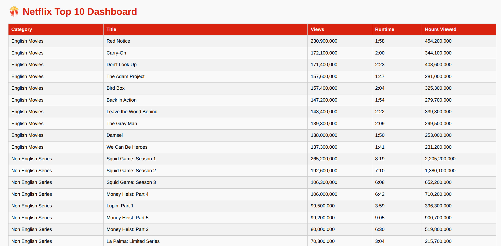

# 🍿 Netflix Top 10 Dashboard

A sleek and professional Python project that scrapes the official Netflix Top 10 lists (Movies & Series — English and Non-English) and displays the data on a clean Flask dashboard. Data is saved in categorized CSVs for easy reference and visualization.

---
## 🖼️ Dashboard Preview


## 🚀 Features

* 🌍 Scrapes Netflix Top 10 from: [https://www.netflix.com/tudum/top10/most-popular](https://www.netflix.com/tudum/top10/most-popular)
* 🧠 Categories:

  * English Movies
  * Non-English Movies
  * English Series
  * Non-English Series
* 💾 Data stored in organized CSVs inside `/data`
* 📊 Interactive Flask dashboard to browse all entries
* 🔁 Modular scraper functions for each category
* 📁 Clean folder structure and reusable code
* 📷 Includes UI screenshot for preview

---

## 🖼️ Dashboard Preview


---

## 🗂️ Folder Structure

```
netflix_top10_dashboard/
│
├── app/
│   ├── static/
│   ├── templates/
│   │   └── index.html
│   └── dashboard.py
│
├── data/                      # Contains all CSV files
├── images/                    # Screenshots and visuals
├── logs/                      # (Optional) Log files
├── utils/
│   ├── scraper.py             # Netflix scraper script
│   └── helpers.py             # Save to CSV utility
│
├── requirements.txt          # All dependencies
└── README.md                 # Project overview
```

---

## 🛠️ Technologies Used

* Python
* Selenium
* BeautifulSoup
* Pandas
* Flask
* HTML/CSS (Bootstrap)

---

## 🔧 How to Run

```bash
# Step 1: Clone the repo
$ git clone https://github.com/yourusername/netflix_top10_dashboard.git
$ cd netflix_top10_dashboard

# Step 2: Setup virtual environment (optional)
$ python3 -m venv venv
$ source venv/bin/activate

# Step 3: Install dependencies
$ pip install -r requirements.txt

# Step 4: Run the scraper
$ python utils/scraper.py

# Step 5: Start Flask app
$ python app/dashboard.py
```

Visit: [http://localhost:5000](http://localhost:5000)

---

## 📜 License

This project is open-source and available under the [MIT License](LICENSE).

---

## 🤝 Contribute

Pull requests are welcome! For major changes, open an issue first to discuss what you'd like to change.

---

## 🙌 Acknowledgments

Inspired by Netflix's official Tudum site and built for fun, learning, and open-source contributions.

---

## 🔗 Let's Connect

Feel free to check out my other projects and connect on [GitHub](https://github.com/yourusername)!
